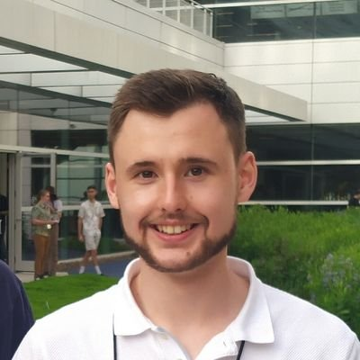

The cost of software failures is a huge burden to the worldwide economy. Consequently, software testing contributes to a large proportion of software development effort and cost. **Flaky tests** are a particular strain on software testing because they intermittently pass and fail without changes to tests or project code with often non-obvious causes. When flaky tests proliferate, developers may loose faith in their test suites, potentially exposing end-users to the consequences of software failures. Flaky tests are a common occurrence in industry, even for large companies with considerable resources to tackle them. **Test FLARE** is an EPSRC-funded project that will develop and empirically evaluate techniques capable of automatically reproducing flaky behaviour. It will also provide developers with automated, human-readable explanations that help them further understand the reasons for the flaky behaviour.

## Objectives

- **Develop automated techniques for synthetically reproducing environmental conditions.** We will formulate a search-based approach to identify the conditions in the execution environment (e.g. CPU speed, disk speed, etc.) that triggers flaky behaviour in a given test. We will do this by developing techniques that make automatic, non-functional changes to test/production code that accurately and efficiently mimic environmental effects during its execution.

- **Develop automated search-based techniques for reliably reproducing different pass/fail flaky test outcomes.** We will define the search space of environmental conditions to explore. One important challenge will be the development of a fitness function that is capable of providing good guidance since not all instances of test flakiness are feasible to control.

- **Develop automated techniques for explaining the sources of flakiness in code to developers.** We will develop techniques to provide human-understandable
explanations for different types of flaky behaviour to developers so that they have the information needed to repair/remove flakiness from test suites, and prevent its recurrence in future.

## Project Team

### Phil McMinn (Principal Investigator)

[Prof. Phil McMinn](https://mcminn.info/) is well-known for his work in search-based software engineering (SBSE) and testing. His 2004 survey of search-based test data generation in the STVR journal is the most cited paper in software testing since 1992, while his 2010 IEEE TSE paper comparing search algorithms for test data generation is the most cited paper in software performance since 2010. He was named one of the top 15 most impactful mid-career software engineering researchers worldwide for 2010-2017, and has won seven best/distinguished paper awards at ASE, GECCO, ICST, ISSTA and SSBSE.

### Owain Parry (Research Associate)

[Dr. Owain Parry](https://o-parry.github.io/) is an early-career researcher with a proven track record in the field of flaky tests. He received his PhD in 2023 with a thesis on flaky tests titled *Understanding and Mitigating Flaky Software Test Cases*. He is the first author of six published papers on the topic,
including a systematic literature survey of flaky tests that appeared in the ACM TOSEM journal.

### Academic Partners

- [Prof. Gordon Fraser](https://www.fim.uni-passau.de/en/chair-for-software-engineering-ii) has published over 200 papers on software engineering and testing, regularly publishing in the top venues in software engineering.

- [Dr. Michael Hilton](https://www.cs.cmu.edu/~mhilton/) researches software engineering and testing. His papers regularly appear at the top international software engineering conferences including ICSE, ASE, and FSE. He has particular expertise in flaky tests and is one of the most-cited authors on the topic.

- [Dr Gregory Kapfhammer](https://www.gregorykapfhammer.com/) researches software engineering and testing and has published over 60 papers, including ones in the IEEE TSE and ACM TOSEM journals, and the ASE, FSE, GECCO, ISSTA, and ICST conferences. He is an Associate Editor of the Journal of Software: Evolution and Process.

### Industrial Partners

- [Microsoft](https://www.microsoft.com/)
- [Duolingo](https://www.duolingo.com/)
- [BJSS](https://www.bjss.com/)
- [Virtuoso](https://www.virtuoso.qa/)
- [Cirata](https://cirata.com/)